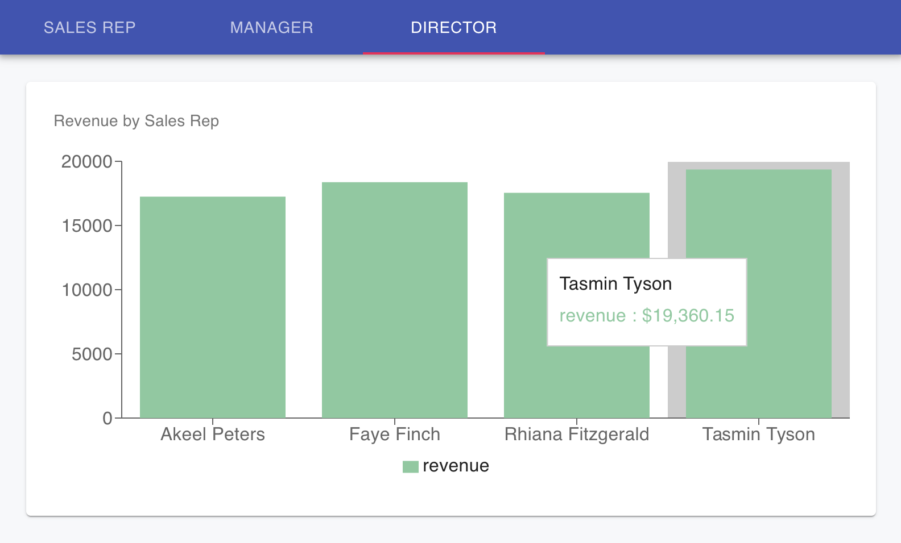

## Your Mission
Hey Full-Stack developer. Welcome. Your mission, should you choose to accept it, is to carve out 2 hours and create a new feature in the single page app provided here.

> Hey this is important! We hope you can spend about two hours on this project. If you can finish faster -- great! If not, limit yourself and don't spend much longer than 2 hours.

## Your Task

Build a new dashboard card showing revenue by sales rep. Users can be sales reps, managers, or directors and the card should display a breakdown for each user based on the sales attributed to all sales reps under them. The database is provided for you and the relevant tables are described in `backend/main/models.py`.

Simplifications:
- each tab in the app is hard coded in `frontend/src/App.jsx` to request a specific user, that's whose "dashboard" is being displayed
- the backend endpoint doesn't take a date so you can just return the data for the current date
- there is no authentication

We've provided a lot of code for you to get up and running fast! This is a feature from our existing codebase, just packaged in a simplified manner, so treat this like a real-world task. You can add other packages/helpers but the ones provided are good enough to get the job done.

## Getting Started
There are three files you need to change to complete this task (although feel free to modify anything else as well):
- `frontend/src/Containers/RevenueGraph.jsx`
- `frontend/src/Components/RevenueGraph.jsx`
- `backend/main/views.py`

The app is dockerized so you can reference the `Dockerfile`s and `docker-compose.yml` for any configuration questions (or just run the app with `docker-compose up --build`).

If you're new to React or Django, here are some resources to help bring you up to speed:
- Django ORM: [Models](https://docs.djangoproject.com/en/3.0/topics/db/models/) and [QuerySets](https://docs.djangoproject.com/en/3.0/ref/models/querysets/)
- [Getting Started with React](https://reactjs.org/docs/hello-world.html) and [Presentational vs Container components](https://medium.com/@dan_abramov/smart-and-dumb-components-7ca2f9a7c7d0)

Please don't hesitate to reach out if you have any questions whatsoever.

## Example




## Running
https://www.digitalocean.com/community/tutorials/build-a-to-do-application-using-django-and-react

``` python manage.py runserver ```

## Console

```
pipenv shell
python manage.py shell
```

## Object Manipulation

### Setup
```py
from main.models import EmployeeRelation
from main.models import SalesLines
from django.contrib.auth.models import User
# important if using timezones
from django.utils.timezone import datetime
```

### Creation
```py
# ids are not created automatically, and must be defined manually.  Also, id() is a special method that gives you the stored address Oo!
emp = EmployeeRelation(start_date=datetime.today(), end_date=datetime.today(), reporting_to=User(), employee=User())
# doesn't autosave relational objects
emp.employee=User()
```

### Deletion
```py

# doesn't get rid of other references
del emp
```

### Retrieval
```py
# list all the fields of an object
vars(emp)
# retrieve all objects
EmployeeRelation.objects.all()
EmployeeRelation.objects.filter(id=32)
```

## Objects Needed
* sales_rep - id=203
* manager - id=32
* director - id=2

### Assumptions
1. The director sees all 4 sales reps.  They report to someone, but that someone can be can be a basic stub, since they aren’t used otherwise
2. The manager reports to the director.  They see a subset of sales reps who they manage (say 2 of them)
3. The sales rep reports to the manager. They see only their own information

```py
# create the director
director = EmployeeRelation(id=2, start_date=datetime.today(), reporting_to=User(username='cio'), employee=User(username='fhuman', is_staff=True, first_name='Finn', last_name='TheHuman', email='fthehuman@example.com'))
director.reporting_to.save()
director.employee.save()
director.save()

# create the managers
manager_01 = EmployeeRelation(id=32, start_date=datetime.today(), reporting_to=director.employee, employee=User(username='jdog', is_staff=True, first_name='Jake', last_name='TheDog', email='jthedog@example.com'))
manager_01.employee.save()
manager_01.save()

manager_02 = EmployeeRelation(id=33, start_date=datetime.today(), reporting_to=director.employee, employee=User(username='bmo', is_staff=True, first_name='B', last_name='Mo', email='bmo@example.com'))
manager_02.employee.save()
manager_02.save()

# create the sales reps
sales_rep_01 = EmployeeRelation(id=203, start_date=datetime.today(), reporting_to=manager_01.employee, employee=User(username='apeters', is_staff=True, first_name='Akeel', last_name='Peters', email='apeters@example.com'))
sales_rep_01.employee.save()
sales_rep_01.save()

sales_rep_02 = EmployeeRelation(id=204, start_date=datetime.today(), reporting_to=manager_01.employee, employee=User(username='ffinch', is_staff=True, first_name='Faye', last_name='Finch', email='ffinch@example.com'))
sales_rep_02.employee.save()
sales_rep_02.save()

sales_rep_03 = EmployeeRelation(id=205, start_date=datetime.today(), reporting_to=manager_02.employee, employee=User(username='rfitzgerald', is_staff=True, first_name='Rhiana', last_name='Fitzgerald', email='ffitzgerald@example.com'))
sales_rep_03.employee.save()
sales_rep_03.save()

sales_rep_04 = EmployeeRelation(id=206, start_date=datetime.today(), reporting_to=manager_02.employee, employee=User(username='ttyson', is_staff=True, first_name='Tasmin', last_name='Tyson', email='ttyson@example.com'))
sales_rep_04.employee.save()
sales_rep_04.save()

# create several saleslines for the sales rep we care about
rep_01_salesline_01 = SalesLines(id=100, rep=sales_rep_01.employee, reporting_day=datetime.today(), sku='sr1123', revenue=28000, commission_rate=3, earnings=840)
rep_01_salesline_01.save()
rep_01_salesline_02 = SalesLines(id=101, rep=sales_rep_01.employee, reporting_day=datetime.today(), sku='sr1124', revenue=18000, commission_rate=3, earnings=540)
rep_01_salesline_02.save()
rep_01_salesline_03 = SalesLines(id=102, rep=sales_rep_01.employee, reporting_day=datetime.today(), sku='sr1124', revenue=1000, commission_rate=3, earnings=30)
rep_01_salesline_03.save()

# create one salesline each for the other sales reps
rep_02_salesline = SalesLines(id=110, rep=sales_rep_02.employee, reporting_day=datetime.today(), sku='sr2123', revenue=22000, commission_rate=3, earnings=660)
rep_02_salesline.save()

rep_03_salesline = SalesLines(id=111, rep=sales_rep_03.employee, reporting_day=datetime.today(), sku='sr3123', revenue=15000, commission_rate=3, earnings=450)
rep_03_salesline.save()

rep_04_salesline = SalesLines(id=112, rep=sales_rep_04.employee, reporting_day=datetime.today(), sku='sr4123', revenue=30000, commission_rate=3, earnings=900)
rep_04_salesline.save()
```